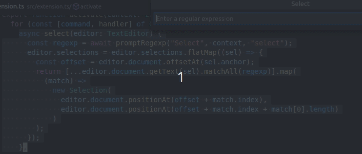
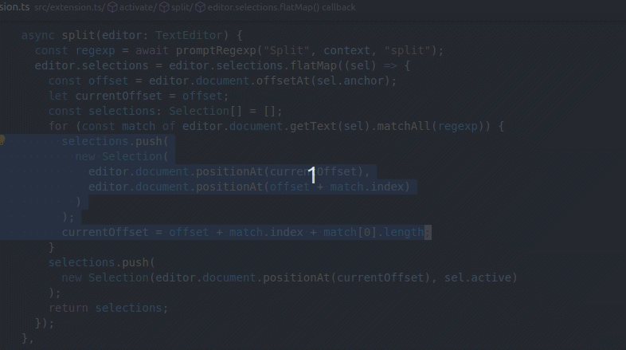
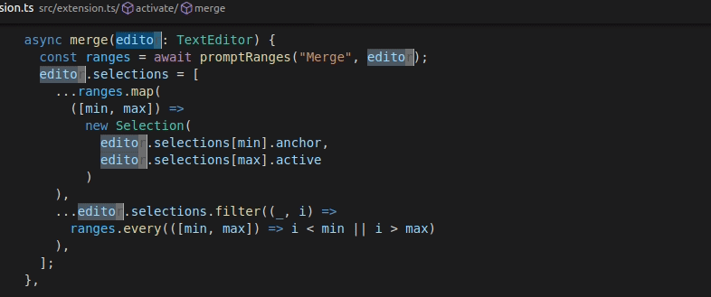
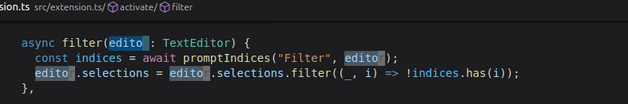
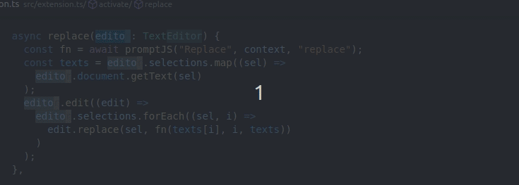
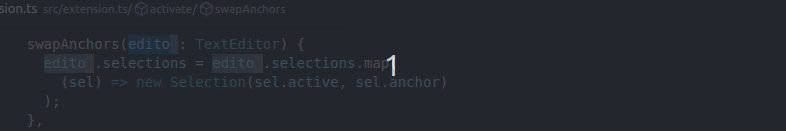
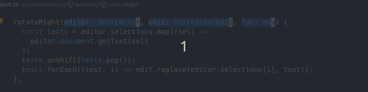
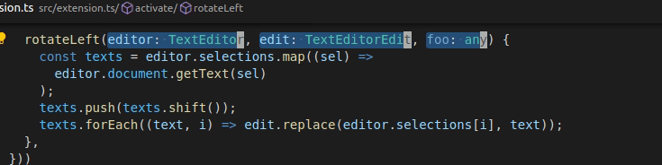

# Selectils

Selection utilities

## Commands

### Select

Prompts for a regular expression, then adds a selection for each match.

- Default keybinding: <kbd>alt</kbd>+<kbd>a</kbd>
- Also seen in:
  [dance](https://github.com/71/dance),
  [better-cursors](https://github.com/Gruntfuggly/better-cursors)

### Split

Prompts for a regular expression, then splits the selections by matches.

- Default keybinding: <kbd>alt</kbd>+<kbd>s</kbd>
- Also seen in:
  [dance](https://github.com/71/dance)

### Merge

Prompts for ranges of indices, then merges each indexed selection range.

- Default keybinding: <kbd>alt</kbd>+<kbd>d</kbd>
- Also seen in:
  [dance](https://github.com/71/dance)

### Filter

Prompts for indices or ranges of indices, then removes the indexed selections.

- Default keybinding: <kbd>alt</kbd>+<kbd>x</kbd>
- Also seen in:
  [dance](https://github.com/71/dance)

### Replace

Prompts for a JS template string, then replaces the selections with the evaluated string.

- Default keybinding: <kbd>alt</kbd>+<kbd>c</kbd>
- Also seen in:
  [replace-selection](https://github.com/nxsoft/replace-selection),
  [functional-cursors](https://github.com/stevengeeky/functional-cursors)

### Swap Anchors

Swaps the anchor and active positions of the selections.

- Default keybinding: <kbd>alt</kbd>+<kbd>z</kbd>

### Rotate Right

Rotates the selections clockwise.

- Default keybinding: <kbd>alt</kbd>+<kbd>]</kbd>
- Also seen in:
  [dance](https://github.com/71/dance),
  [replace-selection](https://github.com/nxsoft/replace-selection)

### Rotate Left

Rotates the selections counterclockwise.

- Default keybinding: <kbd>alt</kbd>+<kbd>[</kbd>
- Also seen in:
  [dance](https://github.com/71/dance),
  [replace-selection](https://github.com/nxsoft/replace-selection)

## License

MIT
